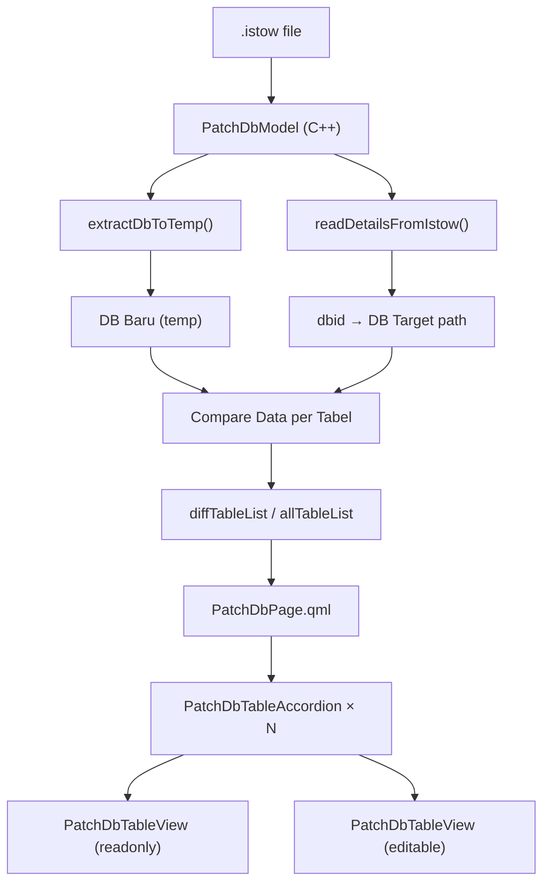

# Walkthrough: Fitur Patch DB Data

## Ringkasan

Fitur ini memungkinkan pengguna membandingkan **data/value** (bukan schema) antara database dari file `.istow` dengan database yang sudah terinstall di `iStowV2/`. Data yang berbeda ditampilkan dalam UI 2-panel side-by-side untuk mempermudah patching secara selektif.

---

## File yang Dibuat/Dimodifikasi

| File | Status | Keterangan |
|---|---|---|
| [PatchDbModel.h](file:///c:/Pranala/IstowUpdater/src/models/PatchDbModel.h) | **NEW** | C++ header — model backend |
| [PatchDbModel.cpp](file:///c:/Pranala/IstowUpdater/src/models/PatchDbModel.cpp) | **NEW** | C++ impl — compare, CRUD operations |
| [PatchDbPage.qml](file:///c:/Pranala/IstowUpdater/src/pages/PatchDbPage.qml) | **MODIFIED** | Halaman utama fitur |
| [PatchDbTableView.qml](file:///c:/Pranala/IstowUpdater/src/pages/PatchDbTableView.qml) | **NEW** | Komponen tabel scrollable |
| [PatchDbTableAccordion.qml](file:///c:/Pranala/IstowUpdater/src/pages/PatchDbTableAccordion.qml) | **NEW** | Komponen accordion per-tabel |
| [CMakeLists.txt](file:///c:/Pranala/IstowUpdater/CMakeLists.txt) | **MODIFIED** | Registrasi file baru |

---

## Arsitektur

---

## PatchDbModel — Backend

### Alur Compare Data
1. `loadAndCompare(istowPath)` dipanggil dari QML
2. Baca `.details` dari `.istow` → dapat `dbid`
3. Ekstrak `.db` ke folder temp
4. Buka kedua DB dengan koneksi SQLite terpisah
5. Untuk setiap tabel yang ada di kedua DB:
   - Deteksi primary key (via `PRAGMA table_info`)
   - Ambil semua rows, indexed by PK
   - Bandingkan value per kolom
   - Tabel dengan perbedaan → masuk `diffTableList`
6. Emit signals → QML ter-update

### Anotasi Diff pada Rows
Setiap row yang dikembalikan oleh `getNewDbRows()` / `getOldDbRows()` memiliki field tambahan:
- `_pk`: nilai primary key
- `_status`: `"match"` | `"diff"` | `"new_only"` | `"old_only"`
- `_diffCols`: comma-separated nama kolom yang berbeda

### Operasi Modifikasi
- `updateCell(table, pk, col, value)` — update 1 cell, parameterized query 
- `replaceRowById(table, pk)` — copy seluruh row dari DB baru ke DB target
- `addRowToOldDb(table, pk)` — insert row baru ke DB target
- `savePendingChanges(table, changes)` — batch update dari pending edits
- `dataVersion` property di-bump setiap modifikasi → trigger refresh UI

---

## QML UI

### PatchDbPage
- File picker (Browse .istow)
- Metadata badges (nama kapal, dbid)
- Filter toggle: "Hanya Beda" / "Semua"
- Welcome state sebelum file dipilih
- Loading indicator saat comparing

### PatchDbTableAccordion
- Click untuk expand/collapse (animasi smooth)
- Badges di header: jumlah rows baru, beda, sama
- Saat expanded: menampilkan 2 panel side-by-side
- Auto-refresh saat `dataVersion` berubah

### PatchDbTableView
- **Mode readonly** (panel kiri):
  - Cell text selectable + copyable
  - Tombol "▶ Replace" per row → replace row di DB target
  - Tombol "+ Add" untuk rows `new_only` → insert ke DB target
- **Mode editable** (panel kanan):
  - Cell adalah TextInput → langsung edit
  - Pending changes di-track → highlight biru muda
  - Tombol "💾 Simpan Semua" muncul jika ada pending
  - Tombol cancel untuk discard pending changes

### Warna Highlight
| Warna | Artinya |
|---|---|
| 🟡 Kuning (`#FEF9C3`) | Cell/row dengan value berbeda |
| 🟢 Hijau (`#F0FDF4`) | Row hanya ada di DB baru |
| 🔴 Merah (`#FEF2F2`) | Row hanya ada di DB target |
| 🔵 Biru (`#EFF6FF`) | Pending edit (belum disimpan) |
| 🔑 Key icon | Kolom primary key |

---

## Verifikasi

- ⬜ Build project di Qt Creator dan pastikan tidak ada error kompilasi
- ⬜ Test dengan file `.istow` yang diketahui isinya
- ⬜ Verifikasi compare menghasilkan diff yang benar
- ⬜ Test Replace by ID, Add Row, dan manual edit + Simpan
- ⬜ Test scroll horizontal/vertikal pada tabel banyak kolom/rows
