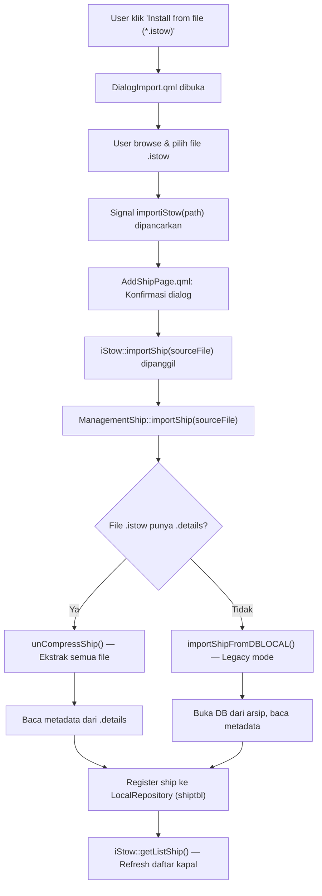
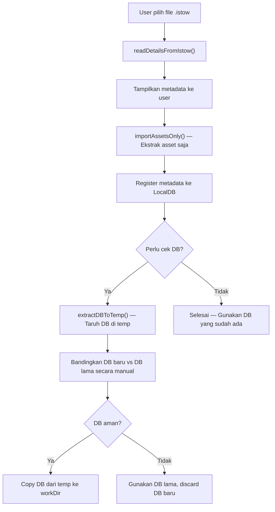

# Referensi Implementasi Import File `.istow`

> Dokumen ini menjelaskan secara detail bagaimana proses **import file `.istow`** bekerja pada proyek **iStowV2-2.5**, termasuk mekanisme ekstraksi asset dan penggantian database. Dokumen ini ditujukan sebagai referensi untuk implementasi di proyek lain, **hanya setup asset tanpa replace DB**.

---

## Daftar Isi

1. [Gambaran Umum Alur Import](#1-gambaran-umum-alur-import)
2. [Format File `.istow`](#2-format-file-istow)
3. [Alur Kode Lengkap (Step-by-Step)](#3-alur-kode-lengkap-step-by-step)
4. [Proses Ekstraksi Asset (unCompressShip)](#4-proses-ekstraksi-asset-uncompressship)
5. [Proses Replace DB (Penjelasan)](#5-proses-replace-db-penjelasan)
6. [Proses Registrasi ke Local DB](#6-proses-registrasi-ke-local-db)
7. [Konvensi Penamaan File & Prefix](#7-konvensi-penamaan-file--prefix)
8. [Panduan Implementasi: Hanya Setup Asset](#8-panduan-implementasi-hanya-setup-asset)
9. [Referensi File Sumber](#9-referensi-file-sumber)

---

## 1. Gambaran Umum Alur Import



---

## 2. Format File `.istow`

File `.istow` adalah arsip biner kustom yang menggunakan `QDataStream` untuk menyimpan pasangan **[nama_file, data_terkompresi]** secara berurutan.

### Struktur Internal

```
┌──────────────────────────────────────────────┐
│  QDataStream                                  │
│  ┌──────────────┬──────────────────────────┐  │
│  │ QString      │ QByteArray (qCompress)   │  │
│  │ "/file1.db"  │ <compressed binary data> │  │
│  ├──────────────┼──────────────────────────┤  │
│  │ QString      │ QByteArray (qCompress)   │  │
│  │ "/file2.png" │ <compressed binary data> │  │
│  ├──────────────┼──────────────────────────┤  │
│  │ QString      │ QByteArray (qCompress)   │  │
│  │ "/ship.details" │ <JSON metadata>       │  │
│  └──────────────┴──────────────────────────┘  │
└──────────────────────────────────────────────┘
```

Setiap entri terdiri dari:
1. **`QString fileName`** — path relatif file (termasuk subfolder)
2. **`QByteArray data`** — konten file yang di-compress menggunakan `qCompress()`

> [!IMPORTANT]
> Semua file dengan prefix yang sesuai (misalnya `42_ShipName_`) akan dimasukkan ke dalam arsip `.istow`. Ini termasuk **database (.db)**, **gambar (.png)**, **model 3D (.stl)**, dan file **metadata (.details)**.

---

## 3. Alur Kode Lengkap (Step-by-Step)

### Step 1: QML — User Interface

| Urutan | File | Keterangan |
|--------|------|------------|
| 1 | [AddShipPage.qml](file:///c:/Pranala/Projects/iStowV2-2.5/istowv2-2.5/Page/PageInitial/AddShipPage.qml) (line 254-265) | Tombol **"Install from file (*.istow)"** membuka `DialogImport` |
| 2 | [DialogImport.qml](file:///c:/Pranala/Projects/iStowV2-2.5/istowv2-2.5/Page/PageInitial/DialogImport.qml) (line 80-87) | `Platform.FileDialog` — filter `*.istow` |
| 3 | [DialogImport.qml](file:///c:/Pranala/Projects/iStowV2-2.5/istowv2-2.5/Page/PageInitial/DialogImport.qml) (line 71-73) | Emit signal `importiStow(destination)` |
| 4 | [AddShipPage.qml](file:///c:/Pranala/Projects/iStowV2-2.5/istowv2-2.5/Page/PageInitial/AddShipPage.qml) (line 294-318) | Konfirmasi dialog, lalu panggil `iStow.importShip(pathiStow)` |

### Step 2: C++ Backend

```
iStow::importShip(sourceFile)                    // istow.cpp:926
  └─> ManagementShip::importShip(sourceFile)      // managementship.cpp:251
        ├─> readDetailsFromIstow(sourceFile)      // Baca .details dari arsip
        │     └─> Return QJsonObject metadata
        ├─> [Jika ada details]:
        │     ├─> Validasi versi DB
        │     ├─> unCompressShip(sourceFile)       // Ekstrak SEMUA file ke homePath
        │     ├─> deleteShip(shipid)               // Hapus data lama dari LocalDB
        │     └─> insertShip(...)                  // Register ke LocalDB
        └─> [Jika tidak ada details (legacy)]:
              └─> importShipFromDBLOCAL(sourceFile) // Mode lama
```

---

## 4. Proses Ekstraksi Asset (unCompressShip)

File: [managementship.cpp](file:///c:/Pranala/Projects/iStowV2-2.5/istowv2-2.5/Core/Utils/managementship.cpp#L68-L135)

### Pseudocode:

```
function unCompressShip(sourceFile):
    workDir = homePath + "/"                    // contoh: C:/Users/T480/iStowV2/
    
    file = open(sourceFile, ReadOnly)
    dataStream = QDataStream(file)
    
    while NOT dataStream.atEnd:
        fileName = dataStream.readQString()     // mis: "/42_ShipName_ship.db"
        data = dataStream.readQByteArray()      // compressed data
        
        // Buat subfolder jika perlu
        subfolder = extractParentPath(fileName)
        mkpath(workDir + subfolder)
        
        // Tulis file hasil dekompresi
        outFile = open(workDir + fileName, WriteOnly)
        outFile.write(qUncompress(data))        // <-- DEKOMPRESI
        outFile.close()
        
        // Catat jika ini file DB
        if fileName.endsWith(".db"):
            dbOutput = fileName
    
    return dbOutput                             // path relatif ke file .db
```

> [!NOTE]
> Fungsi ini menulis **SEMUA** file yang ada dalam arsip `.istow` ke dalam direktori kerja (`homePath`). Ini termasuk file `.db`, gambar, model 3D, dll. Tidak ada filter — semua ditulis/ditimpa.

### File yang Biasanya Diekstrak:

| Tipe File | Contoh Nama | Keterangan |
|-----------|------------|------------|
| Database | `42_ShipName.db` | SQLite database utama kapal |
| Asset gambar | `42_ShipName_owner_logo.png` | Logo pemilik kapal |
| Asset gambar | `42_ShipName_ship.png` | Gambar kapal |
| Model 3D | `42_ShipName_hull.stl` | Model 3D lambung kapal |
| Metadata | `42_ShipName_ship.details` | JSON metadata file |

---

## 5. Proses Replace DB (Penjelasan)

> [!WARNING]
> Bagian ini menjelaskan **bagaimana sistem mengganti database**, bukan instruksi untuk diimplementasikan. Di proyek baru, kamu **TIDAK** perlu mengganti DB secara langsung.

### Bagaimana DB Diganti?

Penggantian DB terjadi secara **implisit**, bukan melalui perintah SQL apa pun. Mekanismenya adalah **file overwrite**:

1. **[unCompressShip()](file:///c:/Pranala/Projects/iStowV2-2.5/istowv2-2.5/Core/Utils/managementship.cpp#63-136)** mengekstrak semua file dari arsip `.istow` ke direktori kerja (`homePath = ~/iStowV2/`).
2. Jika file arsip mengandung file `42_ShipName.db`, maka file ini ditulis ke `~/iStowV2/42_ShipName.db`.
3. Jika file DB dengan nama yang sama sudah ada di direktori tersebut, **file lama langsung ditimpa (overwrite)**.
4. Tidak ada proses migrasi, merge, atau pengecekan data lama. **DB baru 100% menggantikan DB lama.**

### Kapan DB Ini Digunakan?

Ketika user memilih kapal dan login:

```cpp
// istow.cpp:942-947
void iStow::selectShip()
{
    ship->setId(...);
    // DB file di-set berdasarkan "dbid" dari LocalDB (shiptbl)
    ship->setDbFile(customHomeDir + "/iStowV2/" + listShipFiltered[index]["dbid"]);
    ship->setPrefix(...);
}
```

Kemudian `Ship::init()` membaca semua data dari file `.db` ini menggunakan [ShipDataRepository](file:///c:/Pranala/Projects/iStowV2-2.5/istowv2-2.5/Core/ship.cpp#1024-1032).

### Alur Koneksi DB:

```
selectShip()
  └─> ship->setDbFile("C:/Users/T480/iStowV2/42_ShipName.db")
        └─> Ship::init()
              └─> ShipDataRepository (extends Repository)
                    └─> database::open(pathdb, "LOKALDB")
                          └─> QSqlDatabase::addDatabase("QSQLITE")
                                └─> setDatabaseName(pathdb)
                                └─> open()
```

---

## 6. Proses Registrasi ke Local DB

Setelah ekstraksi, metadata kapal didaftarkan ke **Local SQLite Database** (`578b896b3560265ace75015a4f77a672.sqlite`):

File: [localrepository.cpp](file:///c:/Pranala/Projects/iStowV2-2.5/istowv2-2.5/Repository/localrepository.cpp#L79-L107)

### Fungsi [insertShip](file:///c:/Pranala/Projects/iStowV2-2.5/istowv2-2.5/Repository/localrepository.cpp#95-108):

```sql
INSERT INTO shiptbl(idship, tipe, nama, dbid, fileprefix, lastupdate, company, version) 
VALUES(:ship_id, :typestr, :name, :dbid, :prefix, strftime('%s','now'), :company, :version)
```

| Kolom | Contoh Value | Keterangan |
|-------|-------------|------------|
| `idship` | `42` | ID unik kapal |
| `tipe` | `"Container Ship"` | Tipe kapal |
| `nama` | `"MV Example"` | Nama kapal |
| `dbid` | `"42_MVExample.db"` | Nama file database |
| `fileprefix` | `"42_MVExample_"` | Prefix untuk semua asset file |
| `company` | `"PT ABC"` | Nama perusahaan |
| [version](file:///c:/Pranala/Projects/iStowV2-2.5/istowv2-2.5/Core/Utils/managementship.cpp#542-546) | `"10"` | Versi database |

> [!NOTE]
> Sebelum [insertShip](file:///c:/Pranala/Projects/iStowV2-2.5/istowv2-2.5/Repository/localrepository.cpp#95-108), sistem selalu memanggil [deleteShip(shipid)](file:///c:/Pranala/Projects/iStowV2-2.5/istowv2-2.5/Core/istow.cpp#725-729) terlebih dahulu untuk menghapus data kapal lama dengan ID yang sama dari tabel `shiptbl`, `voyagetbl`, dan `conntbl`.

---

## 7. Konvensi Penamaan File & Prefix

Semua file asset kapal mengikuti konvensi penamaan:

```
{ship_id}_{ship_name_sanitized}_{suffix}
```

### Fungsi Sanitasi Nama:

```cpp
// tools.cpp:664-667
QString Helpers::prefixShip(QString ship_id, QString ship_name)
{
    return ship_id + "_" 
         + ship_name.remove(QRegularExpression("[^a-zA-Z0-9\\d\\s]"))
                    .remove(QRegularExpression("\\s"))
         + "_";
}
```

**Contoh:**
- Ship ID: `42`, Ship Name: `MV Example Ship!`
- Prefix: `42_MVExampleShip_`
- DB File: `42_MVExampleShip.db`
- Logo: `42_MVExampleShip_owner_logo.png`

---

## 8. Panduan Implementasi: Hanya Setup Asset

Berikut panduan untuk mengimplementasi import `.istow` di proyek baru yang **hanya mengekstrak asset tanpa menimpa DB**.

### A. Langkah Ekstraksi Asset (Tanpa DB)

Modifikasi yang diperlukan dari [unCompressShip()](file:///c:/Pranala/Projects/iStowV2-2.5/istowv2-2.5/Core/Utils/managementship.cpp#63-136):

```cpp
// PSEUDOCODE — Bukan kode jadi, sesuaikan dengan proyek target

QString importAssetsOnly(QString sourceFile, QString workDir)
{
    QString dbOutput = "";
    QDataStream dataStream;
    QFile file;
    QDir dir;
    
    // Validasi
    QFile src(sourceFile);
    if (!src.exists()) return dbOutput;
    if (!dir.mkpath(workDir)) return dbOutput;
    
    file.setFileName(sourceFile);
    if (!file.open(QIODevice::ReadOnly)) return dbOutput;
    
    dataStream.setDevice(&file);
    
    while (!dataStream.atEnd())
    {
        QString fileName;
        QByteArray data;
        
        // Baca pasangan [namaFile, dataKompresi]
        dataStream >> fileName >> data;
        
        // =====================================================
        // PERBEDAAN UTAMA: SKIP file .db
        // =====================================================
        if (fileName.endsWith(".db")) {
            dbOutput = fileName;  // catat nama DB untuk referensi
            continue;             // JANGAN tulis file DB
        }
        
        // Buat subfolder jika perlu
        for (int i = fileName.length() - 1; i > 0; i--) {
            if (fileName.at(i) == '\\' || fileName.at(i) == '/') {
                QString subfolder = fileName.left(i);
                dir.mkpath(workDir + "/" + subfolder);
                break;
            }
        }
        
        // Tulis file asset (non-DB)
        QFile outFile(workDir + "/" + fileName);
        if (!outFile.open(QIODevice::WriteOnly)) continue;
        outFile.write(qUncompress(data));
        outFile.close();
    }
    
    file.close();
    return dbOutput; // Kembalikan nama file DB untuk pengecekan manual
}
```

### B. Langkah Membaca Metadata dari `.istow`

Untuk mendapatkan informasi kapal tanpa mengekstrak:

```cpp
// Berdasarkan: ManagementShip::readDetailsFromIstow (managementship.cpp:184-217)

QJsonObject readDetailsFromIstow(QString path)
{
    QJsonObject hasil;
    QDataStream dataStream;
    QFile file(path);
    
    if (!file.exists()) return hasil;
    if (!file.open(QIODevice::ReadOnly)) return hasil;
    
    dataStream.setDevice(&file);
    
    while (!dataStream.atEnd())
    {
        QString fileName;
        QByteArray data;
        dataStream >> fileName >> data;
        
        // Cari file .details
        if (fileName.endsWith(".details")) {
            hasil = QJsonDocument::fromJson(qUncompress(data)).object();
            file.close();
            return hasil;
        }
    }
    
    file.close();
    return hasil;
}
```

#### Isi `.details` (QJsonObject):

```json
{
    "idship": 42,
    "nama": "MV Example",
    "tipe": "Container Ship",
    "company": "PT ABC",
    "fileprefix": "42_MVExample_",
    "dbid": "42_MVExample.db",
    "version": 10
}
```

### C. Langkah Ekstraksi DB Secara Terpisah (untuk pengecekan manual)

Jika nanti perlu mengekstrak DB setelah pengecekan manual:

```cpp
// Ekstrak HANYA file .db dari arsip .istow ke lokasi temporary

QString extractDBToTemp(QString sourceFile, QString tempDir)
{
    QFile file(sourceFile);
    if (!file.open(QIODevice::ReadOnly)) return "";
    
    QDataStream dataStream;
    dataStream.setDevice(&file);
    QDir().mkpath(tempDir);
    
    while (!dataStream.atEnd())
    {
        QString fileName;
        QByteArray data;
        dataStream >> fileName >> data;
        
        if (fileName.endsWith(".db")) {
            // Tulis ke folder temporary
            QString tempDbPath = tempDir + "/" + QFileInfo(fileName).fileName();
            QFile outFile(tempDbPath);
            if (outFile.open(QIODevice::WriteOnly)) {
                outFile.write(qUncompress(data));
                outFile.close();
            }
            file.close();
            return tempDbPath;  // path file DB di temporary
        }
    }
    
    file.close();
    return "";
}
```

### D. Alur Implementasi yang Disarankan



---

## 9. Referensi File Sumber

| File | Fungsi/Peran | Path |
|------|-------------|------|
| [DialogImport.qml](file:///c:/Pranala/Projects/iStowV2-2.5/istowv2-2.5/Page/PageInitial/DialogImport.qml) | UI dialog import | [Page/PageInitial/DialogImport.qml](file:///c:/Pranala/Projects/iStowV2-2.5/istowv2-2.5/Page/PageInitial/DialogImport.qml) |
| [AddShipPage.qml](file:///c:/Pranala/Projects/iStowV2-2.5/istowv2-2.5/Page/PageInitial/AddShipPage.qml) | Halaman add ship + trigger import | [Page/PageInitial/AddShipPage.qml](file:///c:/Pranala/Projects/iStowV2-2.5/istowv2-2.5/Page/PageInitial/AddShipPage.qml) |
| [istow.cpp](file:///c:/Pranala/Projects/iStowV2-2.5/istowv2-2.5/Core/istow.cpp) | Entry point [importShip()](file:///c:/Pranala/Projects/iStowV2-2.5/istowv2-2.5/Core/istow.cpp#926-931) | [Core/istow.cpp](file:///c:/Pranala/Projects/iStowV2-2.5/istowv2-2.5/Core/istow.cpp#L926-L930) |
| [managementship.cpp](file:///c:/Pranala/Projects/iStowV2-2.5/istowv2-2.5/Core/Utils/managementship.cpp) | Logic utama: compress, uncompress, import | [Core/Utils/managementship.cpp](file:///c:/Pranala/Projects/iStowV2-2.5/istowv2-2.5/Core/Utils/managementship.cpp) |
| [localrepository.cpp](file:///c:/Pranala/Projects/iStowV2-2.5/istowv2-2.5/Repository/localrepository.cpp) | CRUD ke LocalDB (shiptbl, voyagetbl) | [Repository/localrepository.cpp](file:///c:/Pranala/Projects/iStowV2-2.5/istowv2-2.5/Repository/localrepository.cpp) |
| [repository.cpp](file:///c:/Pranala/Projects/iStowV2-2.5/istowv2-2.5/Repository/repository.cpp) | Base class Repository & DB connection | [Repository/repository.cpp](file:///c:/Pranala/Projects/iStowV2-2.5/istowv2-2.5/Repository/repository.cpp) |
| [database.cpp](file:///c:/Pranala/Projects/iStowV2-2.5/istowv2-2.5/Core/database.cpp) | Koneksi SQLite (QSQLITE driver) | [Core/database.cpp](file:///c:/Pranala/Projects/iStowV2-2.5/istowv2-2.5/Core/database.cpp) |
| [tools.cpp](file:///c:/Pranala/Projects/iStowV2-2.5/istowv2-2.5/Core/Tools/tools.cpp) | Helper: prefix, path, sanitasi nama | [Core/Tools/tools.cpp](file:///c:/Pranala/Projects/iStowV2-2.5/istowv2-2.5/Core/Tools/tools.cpp) |

---

> [!CAUTION]
> - File `.istow` tidak memiliki magic number atau header validasi. Pastikan validasi ekstensi file dilakukan di sisi UI.
> - `qCompress` / `qUncompress` menggunakan format zlib milik Qt. Pastikan proyek target juga menggunakan Qt agar kompatibel.
> - Field [version](file:///c:/Pranala/Projects/iStowV2-2.5/istowv2-2.5/Core/Utils/managementship.cpp#542-546) pada `.details` dapat digunakan untuk mengecek kompatibilitas sebelum melakukan ekstraksi.
